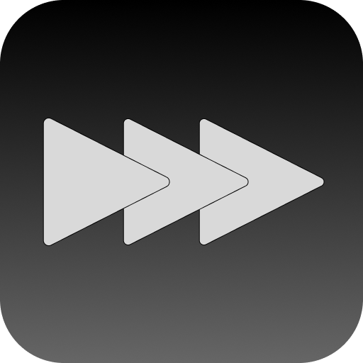

# MusicSpeedChanger (macOS)



A macOS desktop version of the Music Speed Changer mobile app — slow down / speed up
music **without changing pitch**, and shift key **without changing tempo**. Built for
musicians practicing tricky sections. Same layout and feature set as the
[Windows version](https://github.com/embabyty/MusicSpeedChanger), rebuilt with
SwiftUI in the Liquid Glass style of macOS 26.

## Features

- **Tempo control** 50%–200% (presets: 0.5x, 0.75x, 1x, 1.25x, 1.5x), pitch preserved
- **Pitch shift** −12…+12 semitones (0.1-st resolution), tempo preserved
- **AB loop** — set A / B points (badged on the waveform), loop the section while
  practicing, forwards or in reverse
- **Reverse playback** — play backwards from the current position
- **31-band graphic EQ** (ISO 20 Hz–20 kHz, ±15 dB) with presets, bypass switch,
  and a draggable response curve — applied live and in exports
- **Import** MP3, WAV, M4A/AAC, AIFF, FLAC (via Core Audio / AVFoundation)
- **Waveform display** with playhead, click/drag to seek, loop-region highlight,
  and a magnifier menu with zoom Levels 0–10 — zoomed in, the playhead pins to
  the center and the waveform scrolls beneath it
- **Export to WAV** with current tempo + pitch + EQ (exports the AB loop if one
  is set, with loop-repeat count and `_eq` in the filename when EQ is active)
- Volume control, effective-duration readout ("(plays as 2:00 @ 150%)")
- Clean DSP chain: `AVAudioUnitTimePitch` for independent tempo/pitch, two chained
  `AVAudioUnitEQ` nodes for the 31 bands, and an Apple DynamicsProcessor peak
  limiter after the EQ to stop stretch/EQ overshoot from clipping — playback and
  exports alike
- **Automatic updates** — checks this repo's GitHub Releases on startup and offers
  to open the release page when a newer build exists
- **Settings** (⌘, — Apple Music style panes: General, Playback, Files, Advanced):
  update feed + manual check, default tempo/pitch and slider steps, panel visibility,
  waveform detail, click-to-seek, file memory, save/restore of effects (tempo, pitch,
  volume, EQ) across sessions, and system-accent or custom-accent matching
- **Files panel** — keep a list of audio files in a trailing inspector: add via the
  Open button or drag-and-drop, click a track to load and play it, step through the
  list from the transport bar, per-track durations, Clear button, list restored on
  startup (toggle in Settings)

## Tech

- Swift 6 + SwiftUI (macOS 26+, Liquid Glass sidebar / inspector / transport pill)
- AVFoundation only (`AVAudioEngine`, `AVAudioUnitTimePitch`, `AVAudioUnitEQ`) —
  no third-party dependencies

## Run / build

```zsh
# Build
swift build -c release

# Run from source
swift run MusicSpeedChanger

# Package the .app bundle (icon, bundle id, version) into dist/
./scripts/build-app.sh release

# Build the drag-to-Applications installer DMG into dist/
./scripts/build-dmg.sh release
```

Requires Xcode 26+ on macOS 26+. The app itself needs no account, no network
(except the update check), and no extra runtimes.

## Updates & releases

The in-app updater polls the GitHub Releases API
(`embabyty/MusicSpeedChangerMacOS`, configurable in Settings) and offers to open
the release page when a newer tag exists. Version-less dev builds skip the
automatic check. To ship a release:

1. Bump `CFBundleShortVersionString` in `Resources/Info.plist`.
2. Build the installer (`VERSION=<version> ./scripts/build-dmg.sh release`), then
   attach the resulting `dist/MusicSpeedChanger-<version>.dmg` to a GitHub release
   tagged `v<version>` (e.g. `v1.1.0`).

Settings live in `~/Library/Application Support/MusicSpeedChanger/settings.json`
and can be edited by hand when the app is closed; effect state
(tempo/pitch/volume/EQ) is saved there on exit when "Save effects and restore
them on startup" is on.
